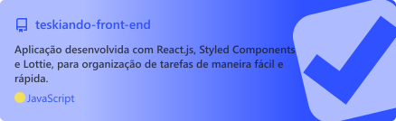

# <a href="#-téskiando-front-end"></a> Téskiando Back-end

Aplicativo para organização de tarefas, com foco em ajudar usuários a gerenciar suas tarefas de maneira fácil e rápida.

As tasks (tarefas) são organizadas baseadas em status (estado), que permitem ao usuário gerenciar a prioridade e identificar quais estão em "A fazer", "Em progresso" ou "Concluído".

Este é o repositório do código de back-end do projeto, que contém a toda a lógica de negócio.

> Através do card abaixo é possível acessar o repositório do código de front-end do projeto

<a href="https://github.com/MiguelRetroz/teskiando-front-end">
  
</a>

## 🛠️ Construído com

🔹<a href="https://developer.mozilla.org/en-US/docs/Web/JavaScript">
  
    - JavaScript
</a>

🔹<a href="https://nodejs.org/en/">
    
     - Node.js
  </a>

🔹<a href="https://www.mongodb.com/">
  
    - MongoDB
</a>

🔹<a href="https://swagger.io/">
    
    - Swagger
</a>

## 🖱️Uso
> A aplicação pode ser acessada através do deploy realizado na plataforma gratuita do <a href="https://vercel.com/" >Vercel</a>:

🔹<a  href="https://teskiando-api.herokuapp.com/" target="_blank"> Vercel - Deploy da aplicação</a>

## 🪛 Desenvolvimento
Basta realizar o clone do projeto, instalar das dependências:
```bash
npm install
```

E rodar:
```bash
npm start
```
para executar a aplicação.

### ⚙️Scripts
> O projeto possui três scripts principais. Para executá-los é necessário realizar a instalação das dependências com `npm install`

Para executar a aplicação:
```bash
npm start
```

Para executar o `ESLint` e realizar a análise estática do código **JavaScript**:
```bash
npm run lint
```

## 👤Contatos
🔹<a href = "mailto:contato.miguelretroz@gmail.com" target="_blank">
  
  Gmail - contato.miguelretroz@gmail.com
</a>

🔹<a href="https://www.linkedin.com/in/miguelretroz/" target="_blank">
  
  Linkedin - Miguel Retroz
</a>

🔹<a href = "https://www.instagram.com/miguel_retroz/" target="_blank">
  
  Instagram - @miguel_retroz
</a>
